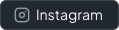

<h1 style='display: flex; jsutify: center; align-items: center; gap: 1rem;'>
    
    MyOwnbrain
</h1>

### 🧰 Languages & Tools & Software

    
    
    
    
    
    
    
    
    
    
    
    
    

_and much more ..._

### 📊 Public GitHub Stats

> At the moment I mainly work on private projects, which are not tracked here.

### 📱 Social Media

Feel free to `✉️contact` me _(please only)_ via [Instagram](https://www.instagram.com/piano.niklas) private message.
